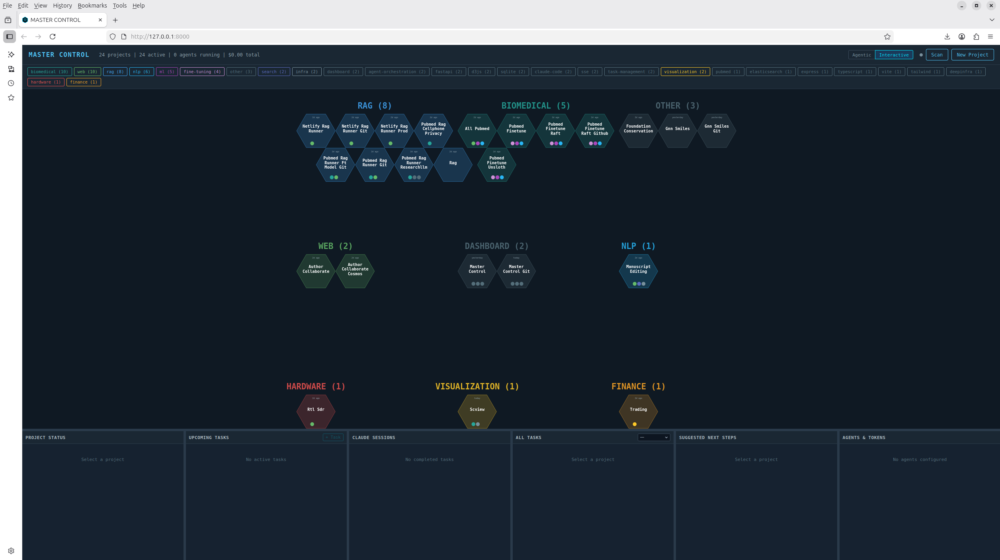
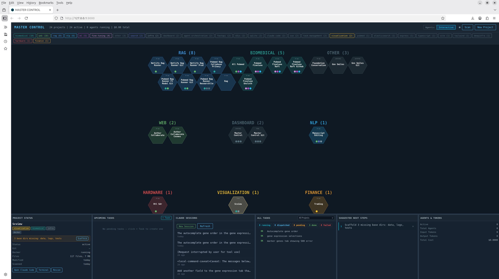
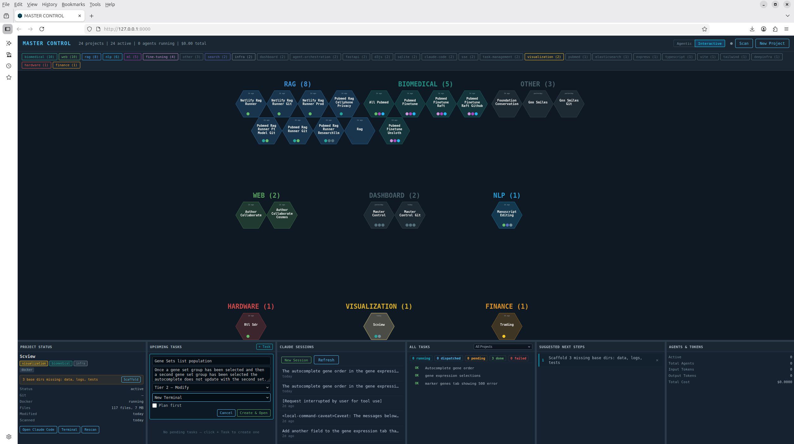
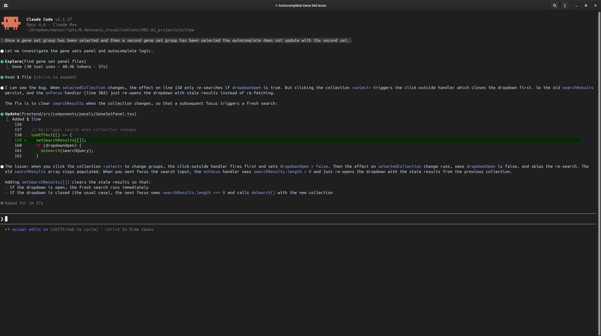
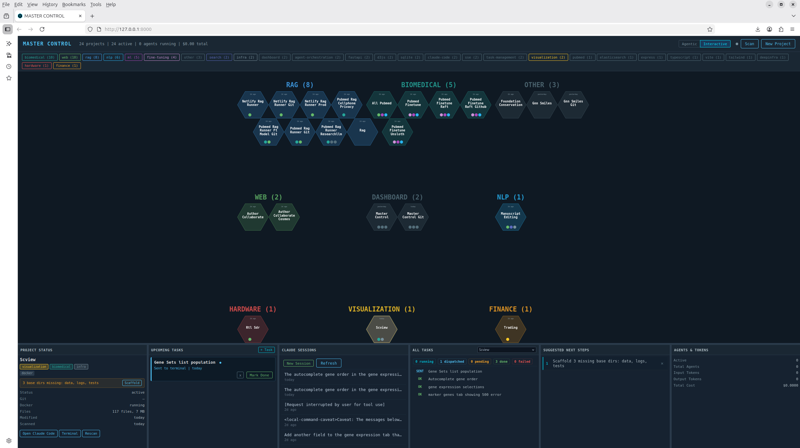
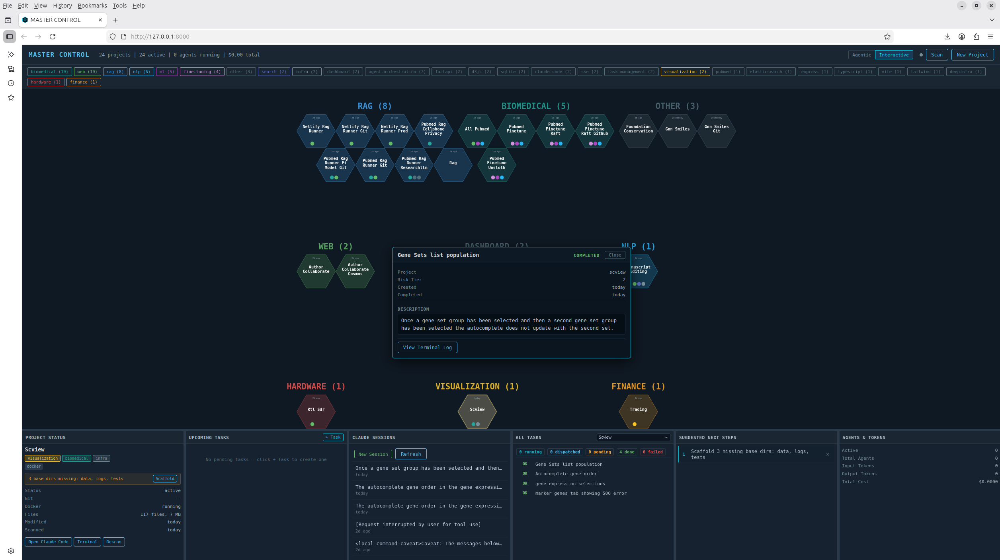
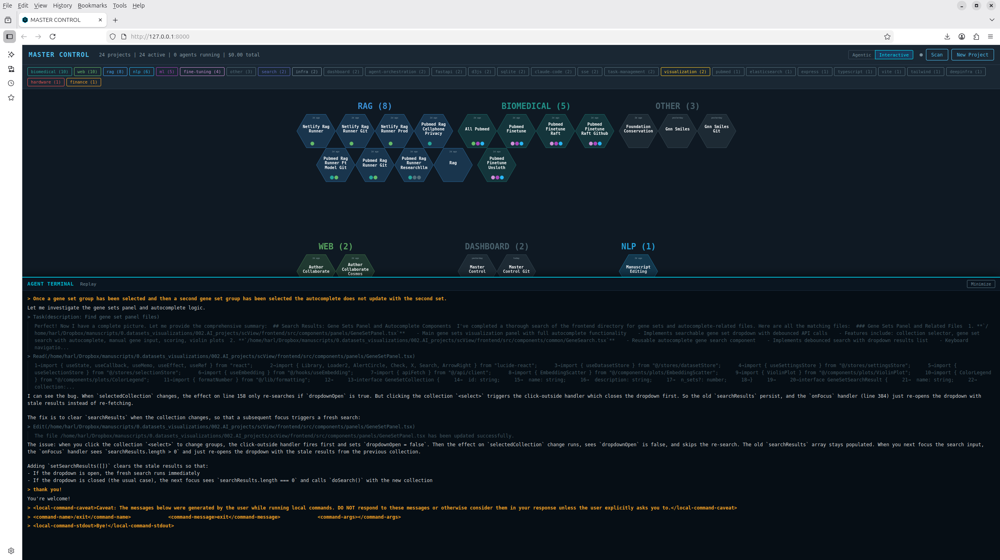

# Master Control


Multi-project control panel for AI-assisted development. Visualize projects on a hex grid, submit and track tasks, and spawn Claude Code sessions that already know your project — no re-explanation needed. FastAPI + D3.js dashboard with dual agentic/interactive modes, session discovery, and cost tracking.


*Full dashboard with hexagonal project grid clustered by tags and 6-panel layout*

## Who Is This For?

Master Control is built for **researchers, engineers, and project leads** who are juggling multiple software or research projects at once — especially those using AI coding assistants like Claude Code. If you find yourself regularly switching between project directories, re-explaining context to your tools, and losing track of what you've done across a dozen or more active efforts, this tool is for you.

## Why?

Modern AI-assisted development is fast — but only within a single project at a time. The moment you're managing a portfolio of 10, 20, or 50+ projects, the overhead adds up:

- **Context loss**: Every time you open a new Claude Code session, you start from scratch — re-explaining the project, its architecture, and what needs doing.
- **Scattered state**: Task history, session logs, and progress live in your head or across disconnected tools.
- **No bird's-eye view**: There's no single place to see which projects need attention, what's in flight, and what's been completed.

Master Control eliminates this friction. It gives you a unified command center where every project's status, tasks, and AI session history are visible at a glance — and where launching new work takes one click instead of five minutes of setup.

## What?

A locally-hosted dashboard that **visualizes and manages all your projects in one place**:

- **Hexagonal grid** — each project is a hex on an interactive SVG grid, color-coded and clustered by tags. Click one to see everything about it.
- **6-panel layout** — project status, upcoming tasks, completed work / Claude sessions, cross-project task browser, suggested next steps, and agent token/cost tracking.
- **Task system** — create, assign, track, and review tasks per project. Full history with terminal logs showing exactly what the AI agent did.
- **Project scanner** — auto-discovers sibling directories, reads their metadata (tech stack, git status, README), and keeps the dashboard current.


*Selecting a project populates all panels — status, tasks, sessions, and cross-project view*

## How?

The core workflow: **submit a task, track it, review the results — across all your projects from one screen.**

1. **Project manifests** (`.mastercontrol/manifest.yaml`) describe each project's architecture, tech stack, and entry points. When you spawn a Claude Code session, it already knows the project — no re-explanation needed.
2. **Dual execution modes**:
   - *Agentic*: Fire off a task and watch Claude Code work in real-time via SSE streaming, with a terminal overlay showing every tool call and result.
   - *Interactive*: Open a Claude Code terminal window pre-configured for the project. The window is tracked — clicking the session in the dashboard brings it back to focus instead of spawning a duplicate.
3. **Session discovery**: Master Control reads Claude Code's native session files, linking tasks to conversation histories. Come back days later and review exactly what happened.
4. **Cross-project visibility**: The "All Tasks" panel shows work across every project, so you always know what's in flight, what's blocked, and what's done.

The result: instead of spending time on project setup and context-switching, you spend it on the work itself.

| | |
|---|---|
|  |  |
| *Creating a new task for a project* | *Claude Code working in an interactive terminal session* |

| | |
|---|---|
|  |  |
| *Completed task visible in the dashboard* | *Task detail overlay with full description and status* |


*Terminal log viewer showing the full agent conversation — every tool call and result*

## Features

- **Hexagonal Grid Dashboard** — SVG hex grid powered by D3.js where each hexagon represents a project, with tag-based clustering and filtering
- **Dual Execution Modes**
  - *Agentic*: Claude Code subprocess with real-time SSE streaming, terminal overlay, and cost tracking
  - *Interactive*: Opens Claude Code in a terminal window with session management and window tracking
- **Task Management** — Full CRUD with status transitions (`pending` → `dispatched` → `completed`), task detail overlays, and terminal log viewer
- **Session Discovery** — Reads Claude Code's `sessions-index.json` and `.jsonl` files to link tasks to conversation histories
- **Project Scanner** — Auto-discovers sibling project directories, extracting metadata, tech stacks, and git status
- **6-Panel Layout** — Project status, upcoming tasks, completed tasks / Claude sessions, all tasks (cross-project), suggested next steps, agents & token usage
- **X11 Window Management** — Finds and activates existing terminal windows instead of spawning duplicates (Linux, via `python-xlib`)

## Architecture

```
┌─────────────────────────────────────────────┐
│              Browser (localhost:8000)       │
│  ┌─────────────────────────────────────────┐│
│  │  Vanilla JS + D3.js  (no build step)    ││
│  └─────────────────────────────────────────┘│
└──────────────────────┬──────────────────────┘
                       │ REST + SSE
┌──────────────────────┴──────────────────────┐
│              FastAPI Backend                │
│  ┌──────────┐ ┌──────────┐ ┌──────────────┐ │
│  │ Routers  │ │ Services │ │   Agents     │ │
│  │ projects │ │ scanner  │ │ coordinator  │ │
│  │ tasks    │ │ sessions │ │ (claude -p)  │ │
│  │ agents   │ │ windows  │ │              │ │
│  │ system   │ │          │ │              │ │
│  └──────────┘ └──────────┘ └──────────────┘ │
│  ┌──────────────────────────────────────┐   │
│  │  SQLite (rebuild-able cache)         │   │
│  └──────────────────────────────────────┘   │
└─────────────────────────────────────────────┘
```

- **Backend**: FastAPI + SQLModel/SQLite + Pydantic Settings
- **Frontend**: Vanilla JS + D3.js — no framework, no build step, served as static files
- **Agent**: Claude Code CLI subprocess (`claude -p --output-format stream-json`)
- **Data authority**: `.mastercontrol/` manifest files are the source of truth; the SQLite database is a rebuild-able cache

## Quick Start

### Prerequisites

- Python 3.12+
- [Claude Code CLI](https://docs.anthropic.com/en/docs/claude-code) installed (for agent features)
- Linux with X11 (for window management features; the dashboard itself works anywhere)

### Setup

```bash
# Clone the repository
git clone https://github.com/YOUR_USERNAME/master-control.git
cd master-control

# Create your environment config
cp .env.example .env
# Edit .env — set MASTERCTL_PROJECTS_DIR to the parent directory
# containing the projects you want to manage

# Install and start
make install   # creates venv + installs dependencies
make dev       # starts the server in foreground mode
```

Open [http://127.0.0.1:8000](http://127.0.0.1:8000) in your browser.

### Production (background)

```bash
./mastercontrol.sh start    # daemonizes, opens browser
./mastercontrol.sh status   # check if running
./mastercontrol.sh stop     # graceful shutdown
```

### Desktop Launcher (Linux)

```bash
make install-desktop   # installs .desktop file to ~/.local/share/applications/
```

## Configuration

All settings use the `MASTERCTL_` prefix and can be set in `.env` or as environment variables.

| Variable | Default | Description |
|---|---|---|
| `MASTERCTL_PROJECTS_DIR` | *(parent of install dir)* | Directory containing your projects |
| `MASTERCTL_HOST` | `127.0.0.1` | Server bind address |
| `MASTERCTL_PORT` | `8000` | Server port |
| `MASTERCTL_CLAUDE_MODEL` | `sonnet` | Claude model for agentic tasks |
| `MASTERCTL_MAX_BUDGET_USD` | `0.50` | Max spend per agent task |
| `MASTERCTL_TERMINAL_CMD` | `gnome-terminal` | Terminal emulator for interactive mode |
| `MASTERCTL_ANTHROPIC_API_KEY` | *(empty)* | Anthropic API key (optional) |
| `MASTERCTL_OPENAI_API_KEY` | *(empty)* | OpenAI API key (optional) |

## Project Structure

```
master-control/
├── app/                        # Frontend
│   ├── static/
│   │   ├── app.js              # Bootstrap, mode management, events
│   │   ├── hex-grid.js         # D3.js hex grid rendering
│   │   ├── panels.js           # 6-panel layout and data binding
│   │   ├── resize.js           # Responsive layout
│   │   ├── utils.js            # API fetch, formatting utilities
│   │   ├── style.css           # RTL-SDR dark theme
│   │   ├── icon.png
│   │   └── icon.svg
│   └── templates/
│       └── index.html          # Main dashboard template
├── backend/
│   ├── src/
│   │   ├── main.py             # FastAPI app factory
│   │   ├── config.py           # Pydantic Settings (MASTERCTL_ prefix)
│   │   ├── cli.py              # CLI entry point
│   │   ├── process_registry.py # Subprocess lifecycle management
│   │   ├── agents/
│   │   │   └── coordinator.py  # Claude Code subprocess orchestration
│   │   ├── db/
│   │   │   ├── models.py       # SQLModel ORM (Project, Task, Agent, ...)
│   │   │   └── database.py     # SQLite engine and session factory
│   │   ├── routers/
│   │   │   ├── projects.py     # Project CRUD and scanning
│   │   │   ├── tasks.py        # Task CRUD and status transitions
│   │   │   ├── agents.py       # Agent dispatch and SSE streaming
│   │   │   └── system.py       # Health, backfill, system endpoints
│   │   └── services/
│   │       ├── project_scanner.py   # Project discovery and metadata
│   │       ├── session_service.py   # Claude Code session discovery
│   │       └── window_manager.py    # X11 window management
│   └── pyproject.toml          # Python package config
├── .mastercontrol/
│   └── manifest.yaml           # Project manifest (source of truth)
├── scripts/
│   └── install-desktop.sh      # Desktop launcher installer
├── mastercontrol.sh            # Main CLI (start/stop/status/restart)
├── Makefile                    # Dev shortcuts
├── .env.example                # Environment template
├── CLAUDE.md                   # Instructions for Claude Code agents
└── LICENSE                     # MIT
```

## Development

```bash
make dev       # Start with auto-reload (foreground)
make start     # Start in background
make stop      # Stop background server
make status    # Check server status
make scan      # Re-scan projects directory
```

The server auto-scans the projects directory on startup. The SQLite database at `data/master_control.db` is created automatically and can be safely deleted — it will be rebuilt from `.mastercontrol/` manifests on next start.

## License

[MIT](LICENSE)
